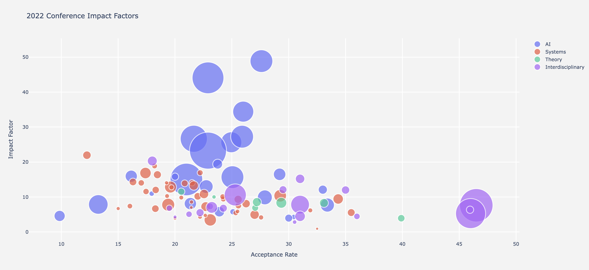

# 2022 Computer Science Conference Impact Factors

Love them or hate them, Impact Factors are one of the main ways in which many schools and departments measure scientific output and impact. Those of us working in non-CS departments have to regularly expain the selectiveness and import of CS conference proceedings to our journal-based colleagues. Here is another tool for that discussion with the dean: Journal Impact Factors for CS Conferences!


								
<table class="sortable">
  <thead>
    <tr>
      <th>Conference</th>
      <th>Impact Factor</th>
      <th>Median # of citations</th>
      <th># of papers</th>
      <th>Acceptance Rate</th>
      <th>Field</th>
    </tr>
  </thead>
  <tbody>
    <tr>
      <td>AAAI</td>
      <td>15.02</td>
      <td>7</td>
      <td>3274</td>
      <td>21%</td>
      <td>AI</td>
    </tr>
    <tr>
      <td>AAMAS</td>
      <td>5.8</td>
      <td>4</td>
      <td>337</td>
      <td>23.9%</td>
      <td>AI</td>
    </tr>
    <tr>
      <td>ACL</td>
      <td>25.66</td>
      <td>12</td>
      <td>1351</td>
      <td>24.95%</td>
      <td>AI</td>
    </tr>
    <tr>
      <td>ACMMM</td>
      <td>9.9</td>
      <td>6</td>
      <td>683</td>
      <td>27.9%</td>
      <td>AI</td>
    </tr>
    <tr>
      <td>ASE</td>
      <td>6.67</td>
      <td>4</td>
      <td>175</td>
      <td>18.27%</td>
      <td>Systems</td>
    </tr>
    <tr>
      <td>ASPLOS</td>
      <td>16.38</td>
      <td>10</td>
      <td>197</td>
      <td>18.45%</td>
      <td>Systems</td>
    </tr>
    <tr>
      <td>ATC</td>
      <td>13.91</td>
      <td>7</td>
      <td>143</td>
      <td>20.85%</td>
      <td>Systems</td>
    </tr>
    <tr>
      <td>CAV</td>
      <td>6.9</td>
      <td>4</td>
      <td>144</td>
      <td>27.05%</td>
      <td>Theory</td>
    </tr>
    <tr>
      <td>CCS</td>
      <td>12.85</td>
      <td>7</td>
      <td>437</td>
      <td>19.6%</td>
      <td>Systems</td>
    </tr>
    <tr>
      <td>CHI</td>
      <td>10.59</td>
      <td>7</td>
      <td>1504</td>
      <td>25.3%</td>
      <td>Interdisciplinary</td>
    </tr>
    <tr>
      <td>CIKM</td>
      <td>8.11</td>
      <td>4</td>
      <td>464</td>
      <td>21.35%</td>
      <td>AI</td>
    </tr>
    <tr>
      <td>COLING</td>
      <td>7.7</td>
      <td>4</td>
      <td>612</td>
      <td>33.4%</td>
      <td>AI</td>
    </tr>
    <tr>
      <td>COLT</td>
      <td>12.1</td>
      <td>6</td>
      <td>255</td>
      <td>33%</td>
      <td>AI</td>
    </tr>
    <tr>
      <td>CRYPTO</td>
      <td>10.02</td>
      <td>7.5</td>
      <td>56</td>
      <td>23.43%</td>
      <td>Theory</td>
    </tr>
    <tr>
      <td>CVPR</td>
      <td>44.08</td>
      <td>23</td>
      <td>3126</td>
      <td>22.9%</td>
      <td>AI</td>
    </tr>
    <tr>
      <td>DAC</td>
      <td>3.45</td>
      <td>1</td>
      <td>468</td>
      <td>23.1%</td>
      <td>Systems</td>
    </tr>
    <tr>
      <td>EC</td>
      <td>7.32</td>
      <td>5</td>
      <td>139</td>
      <td>23.08%</td>
      <td>Interdisciplinary</td>
    </tr>
    <tr>
      <td>ECCV</td>
      <td>34.42</td>
      <td>16.5</td>
      <td>1360</td>
      <td>26%</td>
      <td>AI</td>
    </tr>
    <tr>
      <td>ECIR</td>
      <td>5.78</td>
      <td>3</td>
      <td>114</td>
      <td>25.09%</td>
      <td>AI</td>
    </tr>
    <tr>
      <td>EMNLP</td>
      <td>15.68</td>
      <td>8</td>
      <td>1599</td>
      <td>25.05%</td>
      <td>AI</td>
    </tr>
    <tr>
      <td>EMSOFT</td>
      <td>0.93</td>
      <td>0</td>
      <td>28</td>
      <td>32.5%</td>
      <td>Systems</td>
    </tr>
    <tr>
      <td>ESEC-FSE</td>
      <td>8.1</td>
      <td>6</td>
      <td>215</td>
      <td>26.25%</td>
      <td>Systems</td>
    </tr>
    <tr>
      <td>EuroCrypt</td>
      <td>11.54</td>
      <td>7</td>
      <td>159</td>
      <td>20.55%</td>
      <td>Theory</td>
    </tr>
    <tr>
      <td>EuroGraphics</td>
      <td>4.46</td>
      <td>2</td>
      <td>127</td>
      <td>36%</td>
      <td>Interdisciplinary</td>
    </tr>
    <tr>
      <td>EuroSys</td>
      <td>12.78</td>
      <td>7</td>
      <td>81</td>
      <td>19.69%</td>
      <td>Systems</td>
    </tr>
    <tr>
      <td>FAST</td>
      <td>14.06</td>
      <td>10</td>
      <td>51</td>
      <td>19.25%</td>
      <td>Systems</td>
    </tr>
    <tr>
      <td>FOCS</td>
      <td>8.3</td>
      <td>6</td>
      <td>244</td>
      <td>33.1%</td>
      <td>Theory</td>
    </tr>
    <tr>
      <td>HPCA</td>
      <td>14.07</td>
      <td>8</td>
      <td>123</td>
      <td>21.5%</td>
      <td>Systems</td>
    </tr>
    <tr>
      <td>HPDC</td>
      <td>7</td>
      <td>3</td>
      <td>39</td>
      <td>21.43%</td>
      <td>Systems</td>
    </tr>
    <tr>
      <td>ICAPS</td>
      <td>4.29</td>
      <td>3</td>
      <td>89</td>
      <td>30.45%</td>
      <td>AI</td>
    </tr>
    <tr>
      <td>ICCAD</td>
      <td>4.96</td>
      <td>3</td>
      <td>271</td>
      <td>27%</td>
      <td>Systems</td>
    </tr>
    <tr>
      <td>ICCV</td>
      <td>27.25</td>
      <td>13</td>
      <td>1612</td>
      <td>25.9%</td>
      <td>AI</td>
    </tr>
    <tr>
      <td>ICDE</td>
      <td>7.25</td>
      <td>4.5</td>
      <td>294</td>
      <td>22.7%</td>
      <td>Systems</td>
    </tr>
    <tr>
      <td>ICDM</td>
      <td>4.59</td>
      <td>2</td>
      <td>379</td>
      <td>9.85%</td>
      <td>AI</td>
    </tr>
    <tr>
      <td>ICFP</td>
      <td>6.18</td>
      <td>4</td>
      <td>72</td>
      <td>31.9%</td>
      <td>Systems</td>
    </tr>
    <tr>
      <td>ICLR</td>
      <td>48.87</td>
      <td>20</td>
      <td>1596</td>
      <td>27.6%</td>
      <td>AI</td>
    </tr>
    <tr>
      <td>ICML</td>
      <td>26.66</td>
      <td>10</td>
      <td>2267</td>
      <td>21.65%</td>
      <td>AI</td>
    </tr>
    <tr>
      <td>ICRA</td>
      <td>7.63</td>
      <td>4</td>
      <td>3459</td>
      <td>46.5%</td>
      <td>Interdisciplinary</td>
    </tr>
    <tr>
      <td>ICS</td>
      <td>4.16</td>
      <td>3</td>
      <td>81</td>
      <td>27.57%</td>
      <td>Systems</td>
    </tr>
    <tr>
      <td>ICSE</td>
      <td>13.28</td>
      <td>9</td>
      <td>267</td>
      <td>21.65%</td>
      <td>Systems</td>
    </tr>
    <tr>
      <td>IJCAI</td>
      <td>7.87</td>
      <td>5</td>
      <td>1178</td>
      <td>13.25%</td>
      <td>AI</td>
    </tr>
    <tr>
      <td>IMC</td>
      <td>9.44</td>
      <td>6</td>
      <td>108</td>
      <td>24.25%</td>
      <td>Systems</td>
    </tr>
    <tr>
      <td>INFOCOM</td>
      <td>7.79</td>
      <td>5</td>
      <td>518</td>
      <td>19.4%</td>
      <td>Systems</td>
    </tr>
    <tr>
      <td>IPSN</td>
      <td>4.75</td>
      <td>4</td>
      <td>53</td>
      <td>22.66%</td>
      <td>Systems</td>
    </tr>
    <tr>
      <td>IROS</td>
      <td>5.27</td>
      <td>3</td>
      <td>2796</td>
      <td>46%</td>
      <td>Interdisciplinary</td>
    </tr>
    <tr>
      <td>ISCA</td>
      <td>12.02</td>
      <td>7.5</td>
      <td>164</td>
      <td>18.3%</td>
      <td>Systems</td>
    </tr>
    <tr>
      <td>ISMAR</td>
      <td>5.08</td>
      <td>4</td>
      <td>125</td>
      <td>21.23%</td>
      <td>Interdisciplinary</td>
    </tr>
    <tr>
      <td>ISMB</td>
      <td>6.81</td>
      <td>4</td>
      <td>120</td>
      <td>19.5%</td>
      <td>Interdisciplinary</td>
    </tr>
    <tr>
      <td>ISSTA</td>
      <td>10.09</td>
      <td>6</td>
      <td>103</td>
      <td>24.2%</td>
      <td>Systems</td>
    </tr>
    <tr>
      <td>KDD</td>
      <td>15.95</td>
      <td>8</td>
      <td>456</td>
      <td>16.15%</td>
      <td>AI</td>
    </tr>
    <tr>
      <td>KR</td>
      <td>3.96</td>
      <td>2</td>
      <td>193</td>
      <td>30%</td>
      <td>AI</td>
    </tr>
    <tr>
      <td>LICS</td>
      <td>3.93</td>
      <td>3</td>
      <td>169</td>
      <td>39.9%</td>
      <td>Theory</td>
    </tr>
    <tr>
      <td>MICCAI</td>
      <td>7.82</td>
      <td>4</td>
      <td>1078</td>
      <td>31%</td>
      <td>Interdisciplinary</td>
    </tr>
    <tr>
      <td>MICRO</td>
      <td>10.2</td>
      <td>6.5</td>
      <td>176</td>
      <td>22%</td>
      <td>Systems</td>
    </tr>
    <tr>
      <td>MIDL</td>
      <td>6.36</td>
      <td>3</td>
      <td>165</td>
      <td>45.95%</td>
      <td>Interdisciplinary</td>
    </tr>
    <tr>
      <td>MobiCom</td>
      <td>11.57</td>
      <td>8.5</td>
      <td>122</td>
      <td>17.45%</td>
      <td>Systems</td>
    </tr>
    <tr>
      <td>MobiSys</td>
      <td>9.84</td>
      <td>6</td>
      <td>70</td>
      <td>20.55%</td>
      <td>Systems</td>
    </tr>
    <tr>
      <td>NAACL</td>
      <td>16.49</td>
      <td>8</td>
      <td>477</td>
      <td>29.2%</td>
      <td>AI</td>
    </tr>
    <tr>
      <td>NDSS</td>
      <td>14.31</td>
      <td>9</td>
      <td>178</td>
      <td>16.3%</td>
      <td>Systems</td>
    </tr>
    <tr>
      <td>NeurIPS</td>
      <td>23.27</td>
      <td>9</td>
      <td>4236</td>
      <td>22.9%</td>
      <td>AI</td>
    </tr>
    <tr>
      <td>NSDI</td>
      <td>14.04</td>
      <td>10</td>
      <td>124</td>
      <td>17.03%</td>
      <td>Systems</td>
    </tr>
    <tr>
      <td>OOPSLA</td>
      <td>5.55</td>
      <td>4</td>
      <td>187</td>
      <td>35.5%</td>
      <td>Systems</td>
    </tr>
    <tr>
      <td>OSDI</td>
      <td>18.88</td>
      <td>14</td>
      <td>100</td>
      <td>18.2%</td>
      <td>Systems</td>
    </tr>
    <tr>
      <td>PERCOM</td>
      <td>6.7</td>
      <td>4.5</td>
      <td>50</td>
      <td>15%</td>
      <td>Systems</td>
    </tr>
    <tr>
      <td>PLDI</td>
      <td>10.86</td>
      <td>7</td>
      <td>269</td>
      <td>22.55%</td>
      <td>Systems</td>
    </tr>
    <tr>
      <td>PODC</td>
      <td>5.44</td>
      <td>3</td>
      <td>91</td>
      <td>25.34%</td>
      <td>Systems</td>
    </tr>
    <tr>
      <td>PODS</td>
      <td>3.91</td>
      <td>2.5</td>
      <td>46</td>
      <td>20%</td>
      <td>Systems</td>
    </tr>
    <tr>
      <td>POPL</td>
      <td>7.54</td>
      <td>6</td>
      <td>129</td>
      <td>25.57%</td>
      <td>Systems</td>
    </tr>
    <tr>
      <td>RECOMB</td>
      <td>20.31</td>
      <td>10</td>
      <td>297</td>
      <td>18%</td>
      <td>Interdisciplinary</td>
    </tr>
    <tr>
      <td>RecSys</td>
      <td>10.97</td>
      <td>8</td>
      <td>88</td>
      <td>17.95%</td>
      <td>AI</td>
    </tr>
    <tr>
      <td>RSS</td>
      <td>12.1</td>
      <td>7</td>
      <td>191</td>
      <td>29.5%</td>
      <td>Interdisciplinary</td>
    </tr>
    <tr>
      <td>RTAS</td>
      <td>5.88</td>
      <td>4</td>
      <td>60</td>
      <td>25.5%</td>
      <td>Systems</td>
    </tr>
    <tr>
      <td>RTSS</td>
      <td>4.33</td>
      <td>2</td>
      <td>69</td>
      <td>22.2%</td>
      <td>Systems</td>
    </tr>
    <tr>
      <td>SC</td>
      <td>9.33</td>
      <td>5</td>
      <td>205</td>
      <td>25.55%</td>
      <td>Systems</td>
    </tr>
    <tr>
      <td>Sec</td>
      <td>16.86</td>
      <td>11</td>
      <td>402</td>
      <td>17.4%</td>
      <td>Systems</td>
    </tr>
    <tr>
      <td>SenSys</td>
      <td>10.28</td>
      <td>8</td>
      <td>68</td>
      <td>19.3%</td>
      <td>Systems</td>
    </tr>
    <tr>
      <td>SIGCOMM</td>
      <td>16.94</td>
      <td>13</td>
      <td>108</td>
      <td>22.21%</td>
      <td>Systems</td>
    </tr>
    <tr>
      <td>SIGCSE</td>
      <td>4.5</td>
      <td>3</td>
      <td>341</td>
      <td>31%</td>
      <td>Interdisciplinary</td>
    </tr>
    <tr>
      <td>SIGGRAPH</td>
      <td>15.2</td>
      <td>9</td>
      <td>272</td>
      <td>31%</td>
      <td>Interdisciplinary</td>
    </tr>
    <tr>
      <td>SIGGRAPH-Asia</td>
      <td>12</td>
      <td>7</td>
      <td>211</td>
      <td>35%</td>
      <td>Interdisciplinary</td>
    </tr>
    <tr>
      <td>SIGIR</td>
      <td>19.41</td>
      <td>9</td>
      <td>298</td>
      <td>23.75%</td>
      <td>AI</td>
    </tr>
    <tr>
      <td>SIGMETRICS</td>
      <td>7.4</td>
      <td>5</td>
      <td>93</td>
      <td>16.03%</td>
      <td>Systems</td>
    </tr>
    <tr>
      <td>SIGMOD</td>
      <td>9.44</td>
      <td>6</td>
      <td>332</td>
      <td>34.35%</td>
      <td>Systems</td>
    </tr>
    <tr>
      <td>SODA</td>
      <td>8.34</td>
      <td>4</td>
      <td>361</td>
      <td>29.35%</td>
      <td>Theory</td>
    </tr>
    <tr>
      <td>SOSP</td>
      <td>8.57</td>
      <td>8</td>
      <td>54</td>
      <td>21.45%</td>
      <td>Systems</td>
    </tr>
    <tr>
      <td>SP</td>
      <td>21.96</td>
      <td>16</td>
      <td>219</td>
      <td>12.25%</td>
      <td>Systems</td>
    </tr>
    <tr>
      <td>STOC</td>
      <td>8.55</td>
      <td>6</td>
      <td>247</td>
      <td>27.2%</td>
      <td>Theory</td>
    </tr>
    <tr>
      <td>UbiComp</td>
      <td>4.29</td>
      <td>3</td>
      <td>45</td>
      <td>20%</td>
      <td>Interdisciplinary</td>
    </tr>
    <tr>
      <td>UIST</td>
      <td>6.79</td>
      <td>5</td>
      <td>192</td>
      <td>24.25%</td>
      <td>Interdisciplinary</td>
    </tr>
    <tr>
      <td>VIS</td>
      <td>7.03</td>
      <td>5</td>
      <td>421</td>
      <td>23.23%</td>
      <td>Interdisciplinary</td>
    </tr>
    <tr>
      <td>VLDB</td>
      <td>10.36</td>
      <td>6</td>
      <td>488</td>
      <td>29.25%</td>
      <td>Systems</td>
    </tr>
    <tr>
      <td>VR</td>
      <td>5.53</td>
      <td>4.5</td>
      <td>198</td>
      <td>22.2%</td>
      <td>Interdisciplinary</td>
    </tr>
    <tr>
      <td>WINE</td>
      <td>2.83</td>
      <td>1</td>
      <td>60</td>
      <td>30.52%</td>
      <td>Interdisciplinary</td>
    </tr>
    <tr>
      <td>WSDM</td>
      <td>15.82</td>
      <td>9</td>
      <td>161</td>
      <td>20%</td>
      <td>AI</td>
    </tr>
  </tbody>
</table>

## Methodology
The selection of conferences for this study is based on the list of most impactful international CS venues according to [https://csrankings.org](csrankings.org) (CSR) and the CORE Computing Research and Education ranking. CSR is a crowdsourced community project of CS faculty members tracking the publication output of CS departments and individual researchers in the leading conferences. CORE directly assigns letter grades to conferences. Both platforms are based on the contributions of hundreds of senior faculty-level volunteers around the globe. We included any CS conference listed on CSR (n=77), as well as those that received the highest ranking of A* on CORE (n=60). In total 88 conferences were included, with the majority satisfying both requirements (n=49).

For the included conferences, we computed two-year impact factors for 2022. This process requires collecting all articles published in a given conference in the two preceding years, i.e., in 2020 and 2021 and calculating the average number of citations each article received by any article published in the calendar year 2022.

We included all (n > 40,000) main-track articles (i.e., no extended abstracts, demonstrators, etc.) from the official proceedings and collected 2022 citation counts via Google Scholar. This methodology corresponds to the process employed by Clarivate, Thomson Reuters and others to compute journal impact factors. We adopted CSR's grouping of conferences into fields (AI, Systems, Theory, and Interdisciplinary) and research areas and manually incorporated those conferences only ranked by CORE into the same taxonomy.

Acceptance rates for 2020 and 2021 were obtained from the official conference websites and were averaged to obtain a global estimate of venue selectiveness.

## Limitations
While we followed the official methodology used by Clarivate, Thomson-Reuters and Co, you should be aware of some potential differences. Most notably, where traditional publishing houses will only consider "indexed journals" our counts based on Google Scholar are more inclusive and will tally MS theses, preprints, etc. when counting citation numbers.

## Read the full article
For more details on setup and findings, have a look at the article: [https://arxiv.org/abs/2310.08037"](https://arxiv.org/abs/2310.08037).
								
```
@article{eickhoff2023impact,
  title={Impact Factors for Computer Science Conferences},
  author={Eickhoff, Carsten},
  journal={arXiv preprint arXiv:2310.08037},
  year={2023}
}
```
